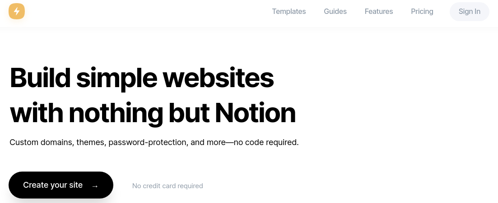

---

slug: why-i-switched-from-onenote-to-notion
title: Why I Switched from OneNote to Notion
author: Ian Nguyen
author_title: Author
author_url: https://github.com/fineon
author_image_url: https://avatars.githubusercontent.com/u/38566281?v=4
date: 2021-09-14
tags: [notion, migration]

---

# Why I Switched from OneNote to Notion

## What is Notion?

Notion is a simple notetaking/ productivity platform that is available on Windows, MacOS, iOS, Android and Web. Notion operates on the concept of [pages](https://www.notion.so/Create-a-new-page-6c3fe9aad94749099ea4bdfc072e5f97). Pages host all available contents and sub pages, including text and image-based content, [database tables](https://www.notion.so/Intro-to-databases-fd8cd2d212f74c50954c11086d85997e), different layout structures and many more. Notion offers a lot of flexibility when it comes to data display and data types, which can fit multitude of needs in different usage settings. For me, I needed a tool that is fast, responsive and can export to other common file formats like [Markdown](https://www.markdownguide.org/getting-started/). 

## Why Notion over OneNote?

Notion has been supporting the features I have been looking for, such as: 

- **Markdown support**: This is the biggest feature that pulled me in. Since Markdown files can be parsed by different tools and widely supported, my content can be easily exported and imported between different platforms. I can also use Markdown syntax to quickly format my content as I type. My syntax and format in a Markdown file will be preserved and can be displayed on other platforms quickly.
- **Diverse layout**: Another neat feature in Notion is that you can insert different content/ data type in a page and organize them in your preferred layout. Notion supports multi-column layout and KanBan, which provides flexibility in content display. One Note pales in this aspect.
- **Common file export**: Notion can export all content in common file formats, like `.md` Markdown, `.html` HTML and `.pdf` PDF files. This is very useful for migration from one platform to another, such as from WordPress to a Markdown-based site generator. My old OneNote application was powerful anf functional, but it only allows `.one` file exports. `.one` file format is not universally recognized and cannot be easily parsed compared to `.md` Markdown files.
- **Fast and responsive web platform**: This is also another winning feature for me, as Notion's web platform is very simple to use and responsive to editing flow. All of my edits are saved instantly. OneNote, on the other hand, performs much slower on the web platform.
- **Growing community**: I actually heard about Notion from my university peers and company teams that often use Notion for collaboration. Notion's future looks bright as there are active communities looking for ways to use it to fit their productivity needs.

## Notion Communities

As more people are discovering about Notion, many enthusiasts have been creating various contents to share Notion's best tips and tricks. 

The productivity community has set its eyes on Youtube as its new home, which housed an abundant videos about how each person use Notion to boost their workflow. 

Source: [Youtube.com](https://youtube.com)

The "studyblr" community on Tumblr is also sharing various tips and Notion templates for any curious students looking to take note more efficiently. "Studyblr" is a niche community on Tumblr that promote productivity and study inspirations and tips. 

Source: [Tumblr.com](https://tumblr.com)

## Extending Past Notetaking

The *notion* of Notion as a pure notetaking platform is extending beyond its main functionality. 

It can now act as a Content Management System (CMS) that supplies content and data to build a website. [Super](https://super.so) is a unique company that build websites based solely on Notion. Their service offer all-in-one website management and building with Notion. 

Some examples: 

- A personal website: [https://redgregory.me](https://redgregory.me/)
- A knowledge base platform: [https://support.milliegiving.com](https://support.milliegiving.com/)
- A personal portfolio site: [https://anotioneer.com/aNotioneer-be59e14d857a4d658db394a0441a3b88](https://www.notion.so/aNotioneer-be59e14d857a4d658db394a0441a3b88)

Notion pages can also report web analytics about who visited a Notion page, thanks to [Notionlytics](https://notionlytics.com/#steps-01-655321). 

I am amazed to see a productivity tool stretching above its general purpose to provide something new entirely.

## Features to be Improved

Notion is still evolving and developing as we speak, and it is no special target exempt from a few issues. As of Sept 14th, 2021, Notion's spell checker does not work very well in pages right now. There are no options to turn it on either. Apparently, pages need to have a lot of words before spell check is turned on, according to [Notion's tweet](https://twitter.com/NotionHQ/status/1164664802754453504?s=20). I have not seen this feature turned on for me yet, but I'm sure it will be completed in future iterations.
