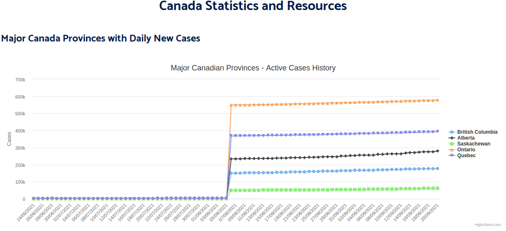
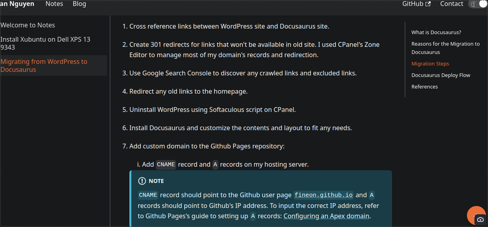
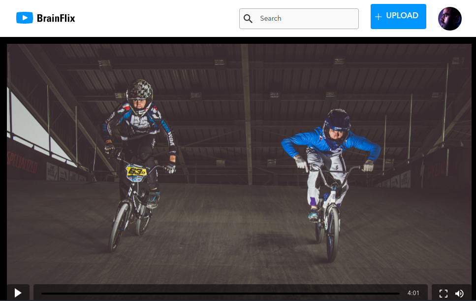
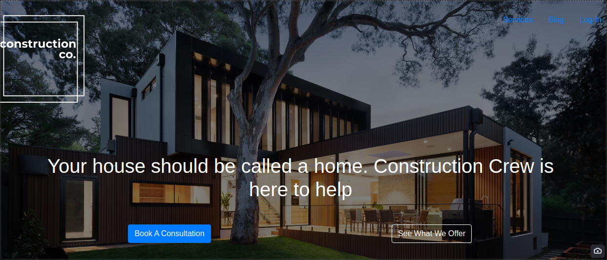

# My Development Projects

Check out applications I have built below and the tech stacks I used to build them. 

## CoDash-19

**Link**: 

- [CoDash-19 website](https://codash-19.herokuapp.com)
- [Github repository](https://github.com/fineon/data-visualization)

**Description**: Built during the peak of COVID-19 pandemic, this web application tracks statistics of COVID-19 cases around the world and in Canada. The web app also offers a succint summary and analysis of current statistics like recovery rate, total cases, death rate, top 5 countries with most cases and more. 

**Tech stack**: 

- Front-end:
    - React.js
    - Axios
    - SCSS
    - Highcharts.js
- Back-end:
    - Express.js
    - Node.js
- Deployment:
    - Heroku CLI
    - Heroku

## Heythereian.com

**Link**:

- [heythereian.com](https://heythereian.com)
- [Github repository](https://github.com/fineon/fineon.github.io/)

**Description**: A rebuild of my personal website using Docusaurus. Features include: Single Page App (SPA) that renders fast, static content rendering of Markdown files, React pages and custom React components. server-side rendering and dynamic sitemap.xml generation for search engine discovery. 

**Tech stack**: 

- Docusaurus
- MDX
- Markdown
- React
- CSS Modules
- Infirma CSS
- Deployment:
    - Github Pages
    - Docusaurus deploy script

## Brainflix

**Link:** 

- [Website](https://nodejs.heythereian.com)
- [Github repository](https://github.com/fineon/brainflix)

**Descriptions**: This is a React application website for a social video network. It is built using React and third-party tools like the CSS pre-processor SCSS. 

**Tech stack**: 

- Front-end:
    - React
    - SCSS
    - Axios
    - React-router
- Back-end:
    - Express.js
    - Node.js
- Deployment
    - CPanel
    - Node.js application using Phusion Passenger

## Construction Co.

**Link:** 

- [Website](https://github.com/fineon/Construction-website)
- [Github repository](https://github.com/fineon/Construction-website)

**Description**: A website built for a construction company that showcases their services and products using the React framework Next.js that combines server-side rendering and client-side application. The website also fetches blog content from a WordPress headless CMS. 

**Tech stack**: 

- Front-end:
    - Next.js
    - React-bootstrap
    - Axios
- Deployment:
    - Heroku CLI